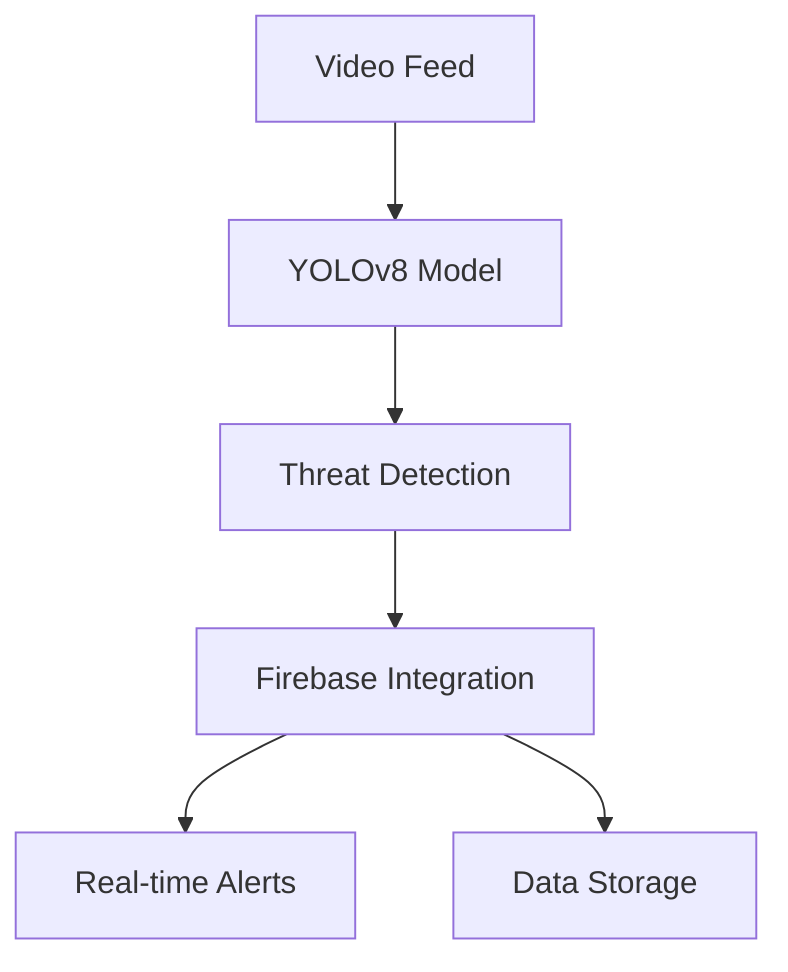

# 🛡️ Guardian View - AI-Powered Security Monitoring System

[](https://www.python.org/downloads/)
[](LICENSE)
[](https://github.com/psf/black)
[](https://codecov.io/gh/omer1004/Guardian-View-RestAPI-Backend)


## 📋 Overview

Guardian View is an advanced security monitoring solution that leverages artificial intelligence to enhance public safety in mall environments. The system utilizes YOLOv8 for real-time weapon detection in surveillance footage, enabling security teams to respond swiftly to potential threats.

### Related Repositories
- 📱 [Frontend Application](https://github.com/GurdainViewFinalProject2024/weaponDetection) - Flutter-based mobile application
- 🔒 This Repository - Backend REST API and AI processing

### Project Documentation
For complete project details, methodology, and research, please refer to our comprehensive [Project Book (PDF)](docs/Project_Book.pdf).

## ✨ Key Features

- **Real-Time Threat Detection**: State-of-the-art YOLOv8 model for accurate weapon detection
- **Cloud Integration**: Seamless Firebase integration for real-time data management
- **Smart Alert System**: Customizable alert mechanisms for security personnel
- **Scalable Architecture**: Designed for high-performance and reliability
- **User-Friendly Interface**: Intuitive dashboard for monitoring and management

## 🏗️ Technical Architecture



### Core Components

1. **AI Engine**: YOLOv8 for real-time object detection
2. **Backend Services**: Python-based processing pipeline
3. **Database**: Firebase Firestore for real-time data
4. **Storage**: Firebase Storage for video and snapshots
5. **Frontend**: Flutter-based monitoring dashboard

## 🚀 Getting Started

### Prerequisites

- Python 3.8+
- Firebase account and API Key
- CUDA-capable GPU (recommended)

### Installation

1. Clone the repository:
   ```bash
   git clone https://github.com/GurdainViewFinalProject2024/GuardianViewRest.git
   cd GuardianViewRest
   ```

2. Create and activate virtual environment:
   ```bash
   python -m venv env
   source env/bin/activate  # On Windows: env\Scripts\activate
   ```

3. Install dependencies:
   ```bash
   pip install -r requirements.txt
   ```

4. Configure Firebase:
   - Create a Firebase project
   - Download your service account credentials
   - Place the credentials file `FIREBASECREDENTIALFILE.json` in the root directory

5. Run the application:
   ```bash
   python GuardianViewSystem.py
   ```

## 🔧 Configuration

The system uses environment variables for configuration. Create a `.env` file in the root directory with the following settings:

```bash
# Firebase Configuration (Required)
FIREBASE_CREDENTIALS_PATH=your-firebase-credentials.json
FIREBASE_PROJECT_ID=your-project-id
FIREBASE_STORAGE_BUCKET=your-project-id.appspot.com
FIREBASE_SETTINGS_DOC_ID=your-settings-doc-id

# Model Configuration (Optional - defaults shown)
YOLO_MODEL_PATH=/WeaponsDetection/guardianViewV2.pt
CONFIDENCE_THRESHOLD=0.7

# Application Settings (Optional - defaults shown)
DEBUG=False
LOG_LEVEL=INFO
VIDEO_SOURCE=0  # 0 for webcam on mac 1 for windows, or path to video file
```

## 🧪 Testing

The project includes comprehensive test coverage:

```bash
# Run video detection tests
python -m unittest Tests/test_video_detection.py


### Test Structure
- `Tests/test_video_detection.py`: Tests for video processing and threat detection
- `Tests/test_firebase_service.py`: Tests for Firebase integration


## 📦 Project Structure

```
GuardianViewRest/
├── Services/              # Service layer implementations
├── Tests/                # Test files and test videos
├── WeaponsDetection/     # YOLO model and detection logic
├── Results/             # Detection results and analysis
├── Videos_from_user/    # User-provided videos for analysis
├── app.py              # Flask application
├── GuardianViewSystem.py # Main system entry point
├── requirements.txt     # Project dependencies
├── dockerfile          # Docker configuration
└── your-firebase-credentials.json  # Firebase credentials (add your own)
```

## 📚 Documentation

For detailed documentation, please refer to:
- [Project Book (PDF)](docs/Project_Book.pdf) - Complete project documentation and research
- [Project Summary](docs/project_summary.md) - Overview of system architecture, features and goals

### Repository Structure
- [Backend (This Repository)](https://github.com/Omer1004/Guardian-View-RestAPI-Backend) - AI processing and REST API
- [Frontend Repository](https://github.com/GurdainViewFinalProject2024/weaponDetection) - Mobile application

## 🤝 Contributing

Contributions are welcome! Please read our [Contributing Guidelines](CONTRIBUTING.md) for details.

## 📝 License

This project is licensed under the MIT License - see the [LICENSE](LICENSE) file for details.

## 🙏 Acknowledgments

- YOLOv8 team for the excellent object detection model
- Firebase team for the robust cloud infrastructure
- OpenCV community for computer vision tools

## 📞 Contact

For questions or support, please open an issue in the repository.

---

<div align="center">
  <sub>Built with ❤️ by Guardian View Team</sub>
</div>


